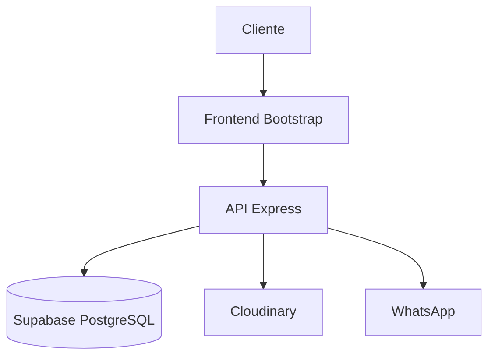
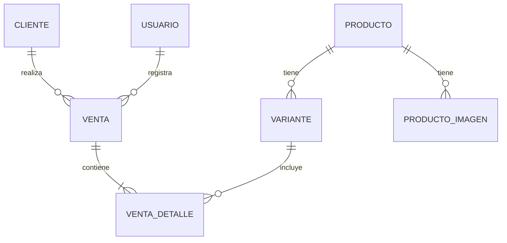
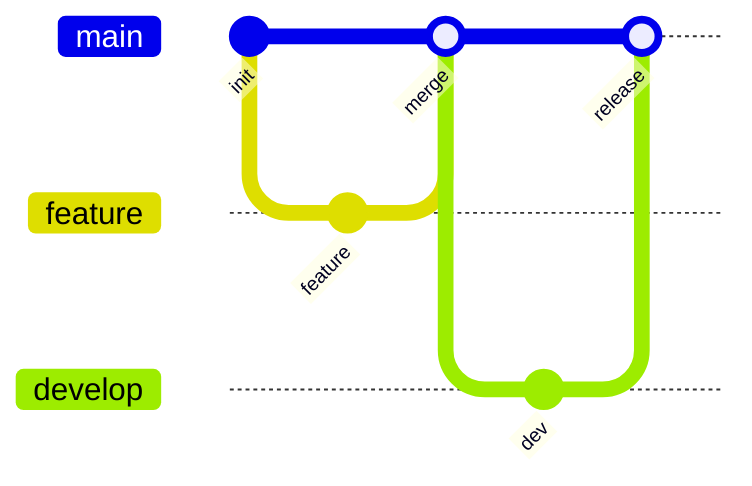

# Control Zapas

Sistema de gestión de stock y ventas para tienda de zapatillas.

## Tecnologías

| Componente | Tecnología  |
|------------|-------------|
| Frontend   | Bootstrap   |
| Backend    | Node.js     |
| API        | Express     |
| Database   | Supabase    |
| Storage    | Cloudinary  |
| Hosting    | Vercel      |

## Arquitectura



## Modelo de Datos



## Despliegue



## Accesibilidad y Estándares

El proyecto sigue estrictos lineamientos de diseño inclusivo para asegurar que el sistema sea utilizable por todos:

### Certificación WCAG 2.1 AA ✅

**Estado**: 7/7 páginas certificadas con 0 violaciones (axe-core)

| Página | Estado | Landmarks |
|--------|--------|----------|
| login.html | ✅ PASS | `<main>`, `<form>` |
| index.html | ✅ PASS | Redirección (no requiere landmarks) |
| dashboard.html | ✅ PASS | `<nav aria-label>`, `<main>` |
| stock.html | ✅ PASS | `<nav aria-label>`, `<main>`, `<nav aria-label="Navegación móvil">` |
| ventas.html | ✅ PASS | `<nav aria-label>`, `<main>` |
| historial.html | ✅ PASS | `<nav aria-label>`, `<main>`, `<nav aria-label="Paginación">` |
| vendedores.html | ✅ PASS | `<nav aria-label>`, `<main>` |

### Estándares Implementados

- **WCAG 2.1 Nivel AA**: Contraste, navegación por teclado, lectores de pantalla
- **ISO 30071-1**: Código de práctica para TIC accesibles
- **Semantización HTML5**: Landmarks (`<main>`, `<nav>`, `<header>`)
- **ARIA Labels**: Todos los elementos interactivos con nombres accesibles
- **Responsive Mobile-First**: Tables → Cards en mobile

### Tokens de Contraste

```css
--colorOnSurface: #1c1e1f;     /* Ratio > 12:1 */
--colorOnSurfaceVar: #4a5d5e;  /* Ratio > 4.5:1 */
--colorPrimary: #0049e6;       /* Ratio > 4.5:1 */
--colorError: #b41340;         /* Ratio > 4.5:1 */
```

## QA y Testing

Se realizan pruebas continuas para asegurar la calidad del software:

- **Tests Unitarios**: Jest para la lógica de negocio y API
- **Tests E2E**: Playwright para flujos críticos de usuario
- **Auditoría A11y**: `node tests/a11y_audit.js` (integrado en CI/CD)
- **Responsive Testing**: Pruebas en 5 viewports coordinadas por **Nestorbot**

### Ejecución de Auditoría A11y

```bash
cd frontend
npm install
npx playwright install chromium
node tests/a11y_audit.js
```

## Roles

| Rol           | Acceso   | Funciones                               |
|---------------|----------|-----------------------------------------|
| Administrador | Desktop  | Dashboard, stock, precios, vendedores   |
| Vendedor      | Mobile   | Ventas (POS), consulta stock, WhatsApp  |

## Instalación y Configuración

1. **Instalar dependencias**:
   ```bash
   npm install
   ```
2. **Configuración**: Crear archivo `backend/.env` basándose en `backend/.env.production.example`.

## Ejecución Local

1. Configurar las variables de entorno en `backend/.env`.
2. Iniciar servidor: `npm start` (en la carpeta backend).
3. Abrir: `http://localhost:3000`.
4. Para pruebas manuales externas: `npx -y tunnelmole 3000`.

## Variables de Entorno

| Variable              | Descripción                              |
|-----------------------|------------------------------------------|
| DATABASE_URL          | URL de conexión a Supabase                |
| SUPABASE_SERVICE_KEY  | Clave de servicio de Supabase            |
| CLOUDINARY_CLOUD_NAME | Nombre de cloud en Cloudinary           |
| CLOUDINARY_API_KEY    | API Key de Cloudinary                   |
| CLOUDINARY_API_SECRET | API Secret de Cloudinary                |
| JWT_SECRET            | Secreto para tokens JWT                 |
| PORT                  | Puerto del servidor (default: 3000)     |

## Despliegue

El proyecto se despliega automáticamente a **Vercel** mediante GitHub Actions al realizar un push a la rama `main`.

- **Frontend**: [https://control-zapas.vercel.app](https://control-zapas.vercel.app)
- **API**: `https://control-zapas.vercel.app/api/*`
