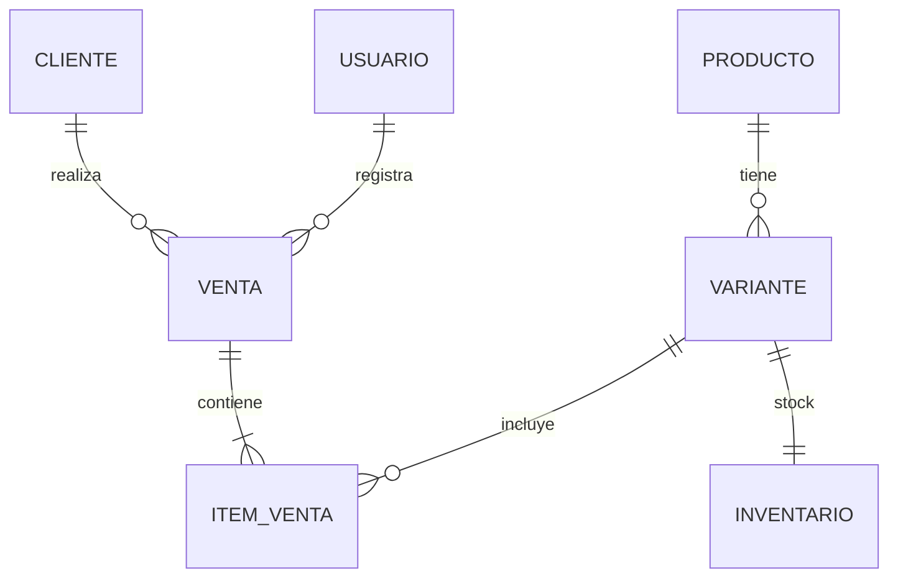

# Resumen Ejecutivo  
La aplicación propuesta es un sistema liviano para gestionar el stock y las ventas de una tienda de zapatillas. Permite registrar productos (talla, color, SKU, precio mayorista/minorista), gestionar existencias y procesar ventas con cálculo de comisiones. Incluye roles definidos: **Administrador** (gestión total y dashboard) y **Vendedor** (ventas y consultas desde móvil). La arquitectura es una aplicación **web responsive** basada en **Node.js, Express y Bootstrap**, con una base de datos relacional (**SQLite** o **PostgreSQL**). El sistema optimiza la comunicación mediante la generación de mensajes de **WhatsApp** para disponibilidad y ventas.

## Requisitos Funcionales  
- **Control de stock:** Maestro de productos con variantes (talla y color) y SKU único. Gestión de precios diferenciados (**Mayorista y Minorista**). Alertas de stock bajo configurables.  
- **Movimientos de ventas y Comisiones:** Registro de ventas asociadas a un vendedor para el cálculo automático de **comisiones**. Historial detallado por vendedor y por cliente.  
- **Mensajes de disponibilidad (WhatsApp):** Generación de mensajes predefinidos para enviar por WhatsApp a clientes sobre disponibilidad de productos y confirmación de ventas.  
- **Tablero de control (PC):** Dashboard para el Administrador con métricas de ventas, ganancias totales, rendimiento de vendedores y niveles críticos de inventario.

## Roles y Permisos  
| Rol           | Acceso   | Funciones clave                                                                 |
|---------------|----------|---------------------------------------------------------------------------------|
| Administrador | PC       | Gestión de stock, precios (mayorista/minorista), vendedores, comisiones y dashboard. |
| Vendedor      | Celular  | Consulta de stock/precios, registro de ventas, historial propio y WhatsApp.       |

Los permisos se asignan según rol: por ejemplo, solo el Administrador puede editar productos o niveles de alarma, mientras el Vendedor solo puede crear ventas y ver el stock disponible.

## Modelo de Datos (Tablas Entidades)  
Las entidades principales son **Productos**, **Variantes de Producto** (por talla/color), **Inventario**, **Ventas**, **Detalle de Venta (line items)**, **Clientes**, **Usuarios** y **Reservas**. Un modelo relacional simple puede incluir:  

| Entidad        | Campos clave                                       | Relación(es)                                                                                       |
|----------------|----------------------------------------------------|----------------------------------------------------------------------------------------------------|
| Producto       | id, nombre, marca, precio_mayorista, precio_minorista| 1 Producto – * Variantes (1:N)                                         |
| Variante       | id, producto_id, SKU, color, talla, stock_actual    | Pertenencia a Producto.                                                            |
| Venta          | id, fecha, cliente_id, vendedor_id, total, comision | Vincula Vendedor (Usuario) y Cliente.                                              |
| Cliente        | id, nombre, contacto (WhatsApp/Email)              | Historial de compras asociado.                                                     |
| Usuario        | id, nombre, rol, password_hash, %_comision         | Administradores y Vendedores.                                                      |

Por ejemplo, una implementación típica sugiere tablas como **Productos(product_id, nombre, categoría, stock_quantity, reorder_level, precio)**, **Ventas(sale_id, fecha, total)**, **DetalleVenta(sale_id, product_id, unidades)**, etc.  

## Flujos Clave de Trabajo  
- **Gestión de Stock (Admin):** El Administrador actualiza existencias y ajusta precios (Mayorista/Minorista) según la demanda. El sistema refleja los cambios en tiempo real para todos los vendedores.  
- **Registro de Venta (Vendedor):** El Vendedor consulta disponibilidad desde su móvil, selecciona el modelo y registra la venta. El sistema descuenta el stock y calcula la comisión correspondiente.  
- **Consulta de Disponibilidad:** Los vendedores pueden buscar modelos por nombre o talla para responder rápidamente a consultas de clientes.  
- **Generación de Mensaje WhatsApp:** Tras confirmar disponibilidad o una venta, el vendedor genera un mensaje predefinido para enviar directamente al cliente por WhatsApp.

## Pantallas y Elementos de UI  
- **Login:** Pantalla inicial de acceso por usuario/contraseña.  
- **Dashboard:** Vista principal tras ingreso: incluye widgets con totales de ventas diarias, gráfico de ventas por mes, lista de productos críticos (stock bajo), ventas recientes, etc. Por ejemplo, el diseño podría mostrar gráficos de barras y líneas, indicadores numéricos grandes y tablas de alertas.  
- **Inventario/Productos:** Tabla o lista con columnas (SKU, nombre, talla, color, stock actual, stock mínimo, precio). Botones para *Agregar/Edit* producto y *Ajustar stock*. Filtros por categoría o búsqueda.  
- **Formulario de Producto:** Para crear o editar producto: campos de texto (nombre, marca, descripción), selección de categoría, opción de subir imagen, precio base. Se habilitan variantes (colores, tallas) con sus propios SKUs.  
- **Lista de Variantes:** Tras guardar producto, se listan sus variantes (talla/color), cada una con stock actual, precio específico, SKU, y opción de editar.  
- **Ventas/POS:** Interfaz tipo POS: campo de búsqueda (por nombre o código), lista de ítems en el carrito con cantidad y subtotal, total de la venta al final, botón “Finalizar Venta”. Al confirmar, mostrar un ticket (PDF/impresión) y limpiar el carrito.  
- **Historial de Ventas:** Tabla con todas las ventas registradas (fecha, total, cliente). Desde aquí se puede filtrar por fecha o cliente, ver detalles, imprimir comprobantes o gestionar devoluciones.  
- **Reservas:** Pantalla que lista reservas activas por cliente/producto, con fechas de expiración, y opciones para “Concretar Venta” o “Cancelar Reserva”.  
- **Configuración:** Menú para gestionar usuarios/roles y parámetros generales (umbral de stock, formas de pago aceptadas, formatos de notificación, etc.).  

## Reglas de Notificación (WhatsApp)  
- **Reglas de envío:**  
  - *Venta confirmada:* Mensaje al cliente con el detalle de su compra y agradecimiento.  
  - *Disponibilidad de Stock:* Mensaje al cliente informando que el modelo/talla solicitado ya está disponible.  
  - *Alerta Administrador:* Notificación interna si el stock cae por debajo del nivel de seguridad.

- **Ejemplos de plantillas:**  
  - **WhatsApp (Vendedor a Cliente):**  
    «¡Hola *[Nombre]*! Te confirmo que tenemos disponibles las *[Zapatillas]* en talla *[Talla]*. El precio es de *[Precio]*. ¿Te las reservo?»  
  - **WhatsApp (Confirmación de Venta):**  
    «¡Gracias por tu compra! Tu pedido de *[Producto]* ha sido registrado con éxito. ¡Que las disfrutes!»

## Reglas de Validación y Negocio  
- Cada producto variante debe tener un **SKU único** para identificación interna.  
- Los campos clave (nombre, SKU, precio, cantidad) son obligatorios; las tallas y colores solo aceptan valores válidos (por ejemplo, tallas 35–45).  
- No se permite stock negativo: antes de confirmar una venta o reserva, el sistema verifica cantidad disponible.  
- Se valida que una reserva no exceda el stock existente.  
- Niveles de alerta: se define un **mínimo de stock** por variante; al caer por debajo, se activa la regla de notificación.  
- En ventas al crédito/depósito, se registra el medio de pago y el estado de pago.  

## Métricas e Indicadores (Dashboard)  
El tablero reporta indicadores clave como:  
- **Ventas Totales (período):** Suma de ingresos por día/semana/mes.  
- **Unidades Vendidas:** Cantidad de pares vendidos en el período.  
- **Rotación de inventario:** Frecuencia de venta del stock disponible, útil para optimizar compras.  
- **Días de inventario:** Tiempo promedio que el inventario tarda en venderse.  
- **Stock Bajo/Critico:** Lista o cuenta de productos con stock cercano al mínimo (alertas).  
- **Top Productos:** Ranking de los más vendidos (por unidades o por ingresos).  
- **Pedidos Pendientes:** Porcentaje de reservas o de pedidos no cumplidos sobre el total.  

Estos datos pueden presentarse con gráficos de barras (ventas por mes), líneas (tendencia de ingresos), tortas (participación por categoría) y medidores. Se actualizarán en tiempo real o con poca latencia al registrar transacciones.  

*Figura: Ejemplo de dashboard con gráficos de desempeño (tasa de rebote, páginas vistas, sesiones) adaptado a métricas de ventas/inventario. La interfaz incluye gráficas y paneles de resumen para monitorear KPIs.*  

## Ejemplos de Filas de Datos  

**Productos** (tabla *Variantes de Producto* como ejemplo):  
| SKU         | Nombre                       | Color  | Talla | Precio (UYU) | Stock | Stock Mínimo |
|-------------|------------------------------|--------|-------|-------------|------|-------------|
| ZAP-AD-42   | Adidas Running | Negro  | 42    | 4500        |  10   | 3           |
| ZAP-NK-38   | Nike Shox     | Blanco | 38    | 5200        |   2   | 5           |
| ZAP-PM-40   | Puma Casual   | Azul   | 40    | 3000        |   8   | 2           |

**Ventas** (tabla *Detalle de Venta* simplificada):  
| Fecha       | Cliente      | SKU      | Cantidad | Precio Unitario (UYU) | Total Venta (UYU) |
|-------------|--------------|----------|----------|-----------------------|------------------|
| 2026-03-10  | Juan Pérez   | ZAP-AD-42|    1     | 4500                  | 4500             |
| 2026-03-11  | María López  | ZAP-NK-38|    2     | 5200                  | 10400            |
| 2026-03-12  | Carlos Díaz  | ZAP-PM-40|    3     | 3000                  | 9000             |

## Wireframes de Pantallas (Descripción)  
- **Inventario:** Lista de productos con buscador y columnas (ID, modelo, talla, color, stock actual, stock mínimo, opciones *Editar*/*Eliminar*). Botón *“Agregar producto”* que abre un formulario.  
- **Venta/POS:** Pantalla dividida: a la izquierda, buscador e ítems agregados (tabla con producto y cantidad); a la derecha, resumen (subtotal, total) y botones *“Confirmar venta”* y *“Cancelar”*.  
- **Dashboard:** En la parte superior, indicadores numéricos (ventas diarias, stock crítico, alertas recientes). Abajo, gráficos grandes (por ejemplo, ventas mensuales en línea, inventario por categoría en barras). Pie de página con reportes rápidos.  

## Tecnologías Seleccionadas  
- **Frontend:** HTML, CSS, JavaScript con **Bootstrap** para un diseño responsive optimizado para PC y móviles.  
- **Backend:** **Node.js** con **Express** para una API REST eficiente.  
- **Base de Datos:** **SQLite** (recomendado para simplicidad inicial) o **PostgreSQL**.  
- **Hosting:** Render, Railway o VPS según escala.

| Componente | Tecnología |
|------------|------------|
| Interfaz   | Bootstrap  |
| Lógica     | Node.js    |
| Datos      | SQLite     |
| Mensajes   | WhatsApp   |

*(Ejemplo: un sistema real en GitHub fue implementado con HTML/CSS/JS y PHP/MySQL, manejando inventario y ventas.)*  

## Seguridad y Respaldo de Datos  
- Autenticación segura (contraseñas hasheadas, por ejemplo bcrypt).  
- HTTPS obligatorio si hay servidor.  
- Roles con permisos mínimos según tabla anterior.  
- Copias de seguridad periódicas de la base de datos (diarias o semanales).  
- Para offline, asegurar encriptación local (según sensibilidad) y sincronización confiable para evitar pérdida.  
- Considerar políticas de auditoría (registro de cambios en inventario/ventas) para seguimiento.  
- Proteger información personal de clientes (cumplir con regulaciones locales de datos).  

## MVP y Esfuerzo de Desarrollo  
| Característica clave            | Descripción breve                               | Esfuerzo   |
|---------------------------------|-------------------------------------------------|------------|
| Registro de productos           | Gestión de modelos y variantes                  | Bajo       |
| Gestión de stock y precios      | Precios mayorista/minorista y stock             | Medio      |
| Registro de ventas y comisiones | Ventas por vendedor y cálculo de comisiones     | Medio      |
| WhatsApp Integration            | Generación de mensajes predefinidos             | Medio      |
| Dashboard Admin                 | Tablero de ventas y ganancias                   | Medio      |

*(La estimación considera equipo pequeño. “Bajo” = pocas semanas, “Medio” = 1-2 meses, “Alto” = >2 meses.)*

En resumen, este proyecto combina buenas prácticas de gestión de inventario con herramientas actuales. Al incluir notificaciones automáticas y métricas clave, se busca optimizar ventas y satisfacción del cliente, mientras se simplifica el trabajo administrativo. Las referencias consultadas detallan características esenciales de sistemas similares y ejemplos de roles, datos y notificaciones adaptables al caso de una tienda de calzado. 

**Fuentes:** Documentación de inventarios y ventas.