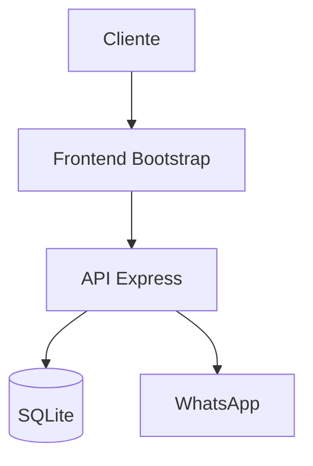
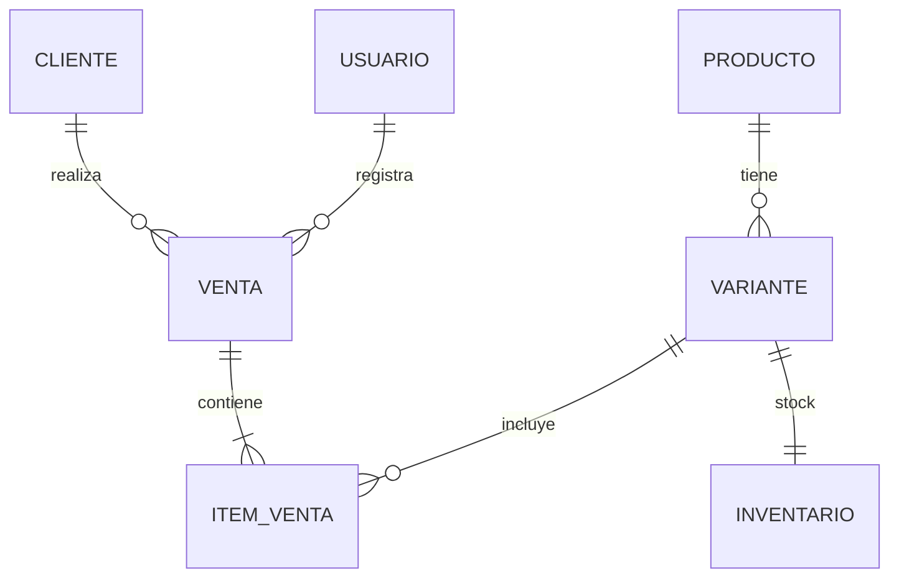
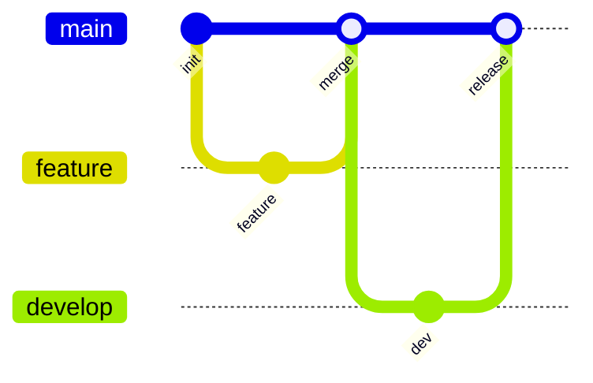

# Control Zapas

Sistema de gestión de stock y ventas para tienda de zapatillas.

## Tecnologías

| Componente | Tecnología  |
|------------|-------------|
| Frontend   | Bootstrap   |
| Backend    | Node.js     |
| API        | Express     |
| Database   | SQLite      |

## Arquitectura



## Modelo de Datos



## Git Workflow



## Roles

| Rol        | Acceso | Funciones                              |
|------------|--------|----------------------------------------|
| Administrador | PC   | Dashboard, stock, precios, vendedores  |
| Vendedor   | Móvil  | Ventas, consulta stock, WhatsApp       |

## Instalación

```bash
npm install
npm start
```
## Ejecución Local

1. `npm start` en la carpeta backend
2. Abrir `http://localhost:3000`
