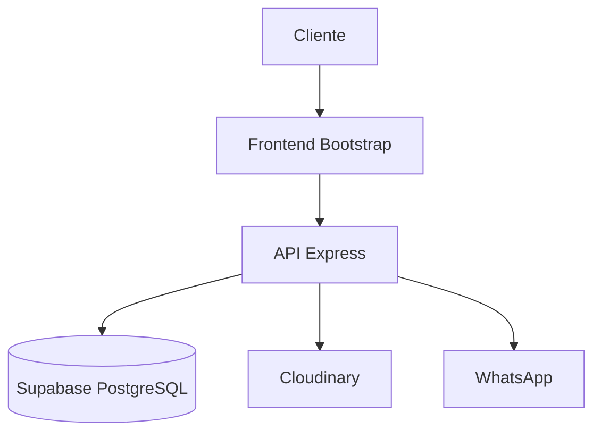
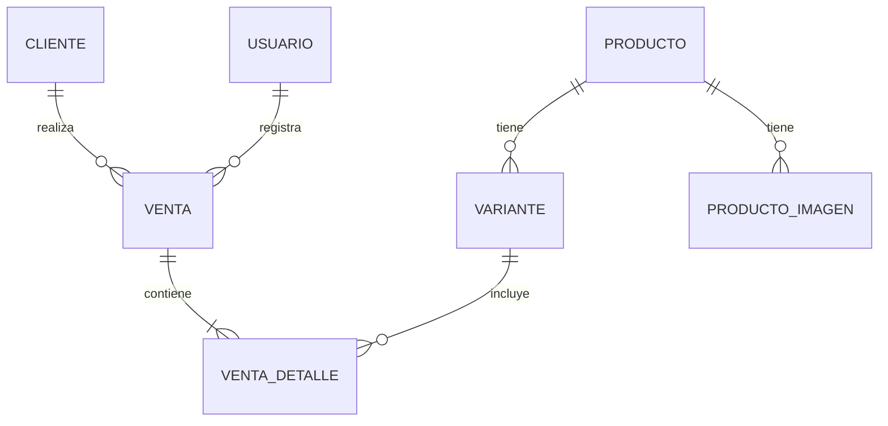
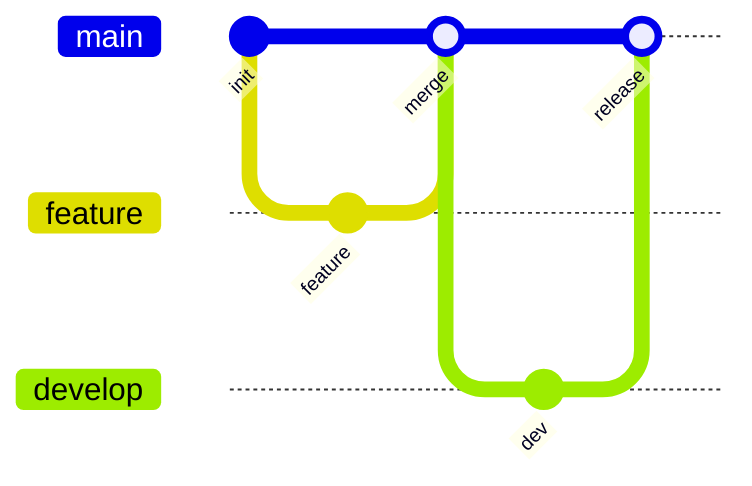

# Control Zapas

Sistema de gestión de stock y ventas para tienda de zapatillas.

## Tecnologías

| Componente | Tecnología  |
|------------|-------------|
| Frontend   | Bootstrap   |
| Backend    | Node.js     |
| API        | Express     |
| Database   | Supabase    |
| Storage    | Cloudinary  |
| Hosting    | Vercel      |

## Arquitectura



## Modelo de Datos



## Despliegue



## Roles

| Rol           | Acceso | Funciones                              |
|---------------|--------|----------------------------------------|
| Administrador | PC     | Dashboard, stock, precios, vendedores  |
| Vendedor      | Móvil  | Ventas, consulta stock, WhatsApp       |

## Instalación

```bash
npm install
```

## Configuración

1. Crear archivo `backend/.env` con las variables de entorno necesarias
2. `backend/.env.production.example` para las variables requeridas

## Ejecución Local

1. Configurar las variables de entorno en `backend/.env`
2. `npm start` en la carpeta backend
3. Abrir `http://localhost:3000`

## Variables de Entorno

| Variable              | Descripción                              |
|-----------------------|------------------------------------------|
| DATABASE_URL          | URL de conexión a Supabase                |
| SUPABASE_SERVICE_KEY  | Clave de servicio de Supabase            |
| CLOUDINARY_CLOUD_NAME | Nombre de cloud en Cloudinary           |
| CLOUDINARY_API_KEY    | API Key de Cloudinary                   |
| CLOUDINARY_API_SECRET | API Secret de Cloudinary                |
| JWT_SECRET            | Secreto para tokens JWT                 |
| PORT                  | Puerto del servidor (default: 3000)     |

## Despliegue a Producción

El proyecto se despliega automáticamente a Vercel mediante GitHub Actions al pushear a la rama `main`.

- **Frontend**: https://control-zapas.vercel.app
- **API**: https://control-zapas.vercel.app/api/*

## Ejecución Local

1. `npm start` en la carpeta backend
2. Abrir `http://localhost:3000`
3. npx -y tunnelmole 3000

